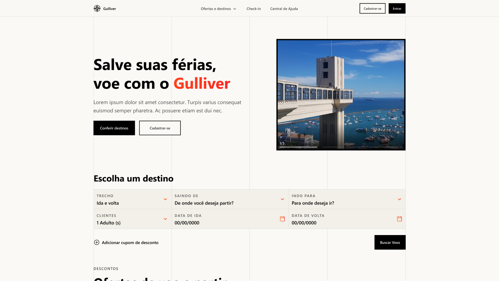

## Atividade 2 - Gulliver Traveler


---

## Preview

<p align="center"> </p>

---

## Tecnologias

- [HTML]()
- [CSS]()
- [Javascript]()
---

### **Iniciando o projeto**

```bash
# Você precisa ter node na sua máquina para rodar o projeto
# Não lembra se possui o node? Execute node -v no seu terminal
$ node -v

# Execute npm install para instalar as dependências
$ npm install

# Execute npm start para iniciar a aplicação 
$ npm start

# A página será aberta em localhost na porta indicada no seu terminal (:

```

---

Feito por [Alexandre Shyjada](https://www.alexshyjada.com/) 😎